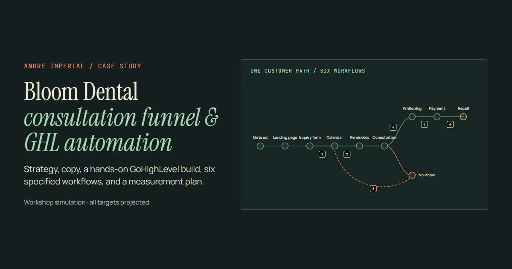

# Bloom Dental Studio: Consultation Funnel & GHL Automation

**Case study by Andre Imperial** · [View the live site](https://ghlautomation.onrender.com/) · [Browse the deliverables](deliverables/) · [Email me](mailto:imperial.andrejoseece@gmail.com)

[](https://ghlautomation.onrender.com/)

I took a dental clinic brief from discovery to a partly tested GoHighLevel (GHL) build: strategy, campaign assets, a CRM pipeline, six specified automation workflows, and a measurement plan. This was a workshop simulation from the Libre Academy Fast Track Workshop. Bloom Dental Studio is a fictional clinic, and the campaign was never launched, so every performance figure here is a projected goal.

## The problem

The workshop scenario gave Bloom Dental about 20 leads a month, only six bookings, and a 35% no-show rate. Awareness wasn't the issue. People were getting lost between seeing the offer, booking, and showing up.

## What I did

| Phase | Decision or output |
|---|---|
| 1. Discovery | Turned the intake and discovery call into one problem statement: conversion and follow-up, not awareness. |
| 2. Strategy | Led with a free 30-minute consultation. Whitening became a follow-up after the visit, not the first ask. |
| 3. Assets | Wrote the landing-page copy, inquiry form, FAQs, and a 9-message email and SMS sequence (5 emails, 4 SMS) with timing and stop rules, working from the workshop’s original 23-message sample. |
| 4. GHL build | Configured a 6-stage pipeline, 10 tags, 8 custom fields, the inquiry form, a 30-minute calendar, and the landing page, and specified six workflows. |
| 5. Test & measure | Tested the form and calendar path, checked one workflow’s execution log, and built a KPI scorecard with formulas and reporting windows. |

The six workflows cover new-lead booking, confirmation and reminders, no-show recovery, post-consultation whitening follow-up, payment update, and six-month recall. Each is specified with a trigger, waits, SMS-consent branches, handoffs, and a stop rule; not all six were run end to end.

## What testing showed

- **Worked:** a test inquiry went through the form and booked a consultation. The execution log showed the contact entering the workflow with its tag and opportunity actions.
- **Caught before launch:** GHL queued the confirmation email, but delivery failed. A verified sender and a passing delivery test are now launch requirements.
- **Not measured:** no ads ran. The targets (60 bookings in 60 days, no-show below 15%, 40% whitening attach rate) are projected.

## Deliverables

All eight deliverables and both filled templates are in [`deliverables/`](deliverables/). Each is readable in full on the site, with a PDF download.

| # | Document | Files |
|---|---|---|
| 01 | Marketing Strategy Document | [Markdown](deliverables/01_Marketing_Strategy_Document.md) · [PDF](deliverables/pdf/01_Marketing_Strategy_Document.pdf) |
| 02 | Integrated Campaign Plan | [Markdown](deliverables/02_Integrated_Campaign_Plan.md) · [PDF](deliverables/pdf/02_Integrated_Campaign_Plan.pdf) |
| 03 | Funnel Map and GHL Blueprint | [Markdown](deliverables/03_Funnel_Map_and_GHL_Blueprint.md) · [PDF](deliverables/pdf/03_Funnel_Map_and_GHL_Blueprint.pdf) |
| 04 | Landing Page Copy Deck | [Markdown](deliverables/04_Landing_Page_Copy_Deck.md) · [PDF](deliverables/pdf/04_Landing_Page_Copy_Deck.pdf) |
| 05 | Email and SMS Sequence | [Markdown](deliverables/05_Email_SMS_Sequence.md) · [PDF](deliverables/pdf/05_Email_SMS_Sequence.pdf) |
| 06 | GHL Workflow Specification | [Markdown](deliverables/06_GHL_Workflow_Specification.md) · [PDF](deliverables/pdf/06_GHL_Workflow_Specification.pdf) |
| 07 | Analytics and KPI Plan | [Markdown](deliverables/07_Analytics_KPI_Plan.md) · [PDF](deliverables/pdf/07_Analytics_KPI_Plan.pdf) |
| 08 | GHL Build Checklist | [Markdown](deliverables/08_GHL_Build_Checklist_Paste_Ready.md) · [PDF](deliverables/pdf/08_GHL_Build_Checklist_Paste_Ready.pdf) |
| T1 | Business Case Intake Worksheet (filled) | [PDF](deliverables/templates/WS_00_Business_Case_Intake_Worksheet_FILLED_Bloom_Dental.pdf) |
| T2 | KPI Scorecard (filled) | [Workbook](deliverables/templates/WS_08_KPI_Scorecard_FILLED_Bloom_Dental.xlsx) |

## Credits

Built from the Libre Academy Fast Track Workshop brief and materials. The workshop source library credits the academy's discovery transcript, setup guides, and sample message sequence.

## Contact

Andre Imperial · [imperial.andrejoseece@gmail.com](mailto:imperial.andrejoseece@gmail.com)

---

## For developers

The site is static HTML, CSS, and JavaScript with no build step. Render serves the repository root using `render.yaml`.

### Run locally

```powershell
py -3 -m http.server 4173 --bind 127.0.0.1
```

Then open `http://127.0.0.1:4173/#overview`.

### Routes

The story runs Overview → System → Build → Measurement → Conclusion, with Deliverables at the end of the nav as the project library.

- `#overview`: animated system diagram, at-a-glance summary, contribution, workshop phases, GHL build areas, verification ledger.
- `#system` (and `#automation`): customer journey and the six interactive workflow maps.
- `#build`: ten detailed build steps with technical setup.
- `#measurement`: baseline-vs-projected funnel chart, formulas, reporting windows, and diagnostic lab.
- `#conclusion` (and `#contact`): decisions, lessons, launch dependencies, and the contact block.
- `#deliverables`: the eight deliverables, two filled templates, GHL terms, and the workshop source library. Deep links such as `#deliverables/kpi-scorecard` open one document.
- `#present/1`: optional 25-slide presentation with presenter notes.

Legacy links (`#problem`, `#tour`, `#solution`, `#board`, `#implementation`, `#process`, `#evidence`, `#documents`, `#results`) still resolve.

### Tests

The browser tests use Playwright and Node's test runner against a local server on port 4173. Playwright is only needed for testing; the site itself has no dependencies.

```powershell
npm install
npx playwright install chromium
npm run serve    # in a second terminal
npm test
```

They cover content completeness, routes, workflow interactions, responsive overflow, ARIA relationships, reduced motion, presentation timing, and keyboard focus. Integrity tests also fail on links to missing deliverables, rendered "undefined", projected figures without a projected/goal label, undefined CSS custom properties, new dated CSS patch sections, headings rewritten by JavaScript, and slides without their own presenter notes.

### Editing notes

- All visible copy lives in `index.html`: document intros and download links, measurement copy, build steps, slides, and presenter notes. `script.js` renders only interactive widgets; a test fails if it rewrites authored headings.
- Routes, workflow data, the journey and KPI widgets, and presentation behavior live in `script.js`.
- The visual system, responsive layouts, focus states, and motion live in `styles.css`.
- Fonts, Lucide, GSAP, and ScrollTrigger are self-hosted in `assets/`.
- Keep projected figures labeled as projected until real campaign data exists. Don't add account screenshots, testimonials, or achieved-result claims.
- If a deliverable changes, update the Markdown and PDF in `deliverables/` along with the site content.
